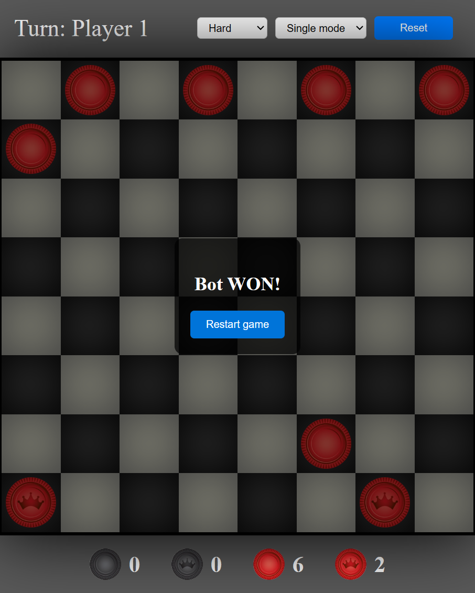

## Checkers using Alpha beta
This Checkers game is designed to adhere to the official tournament rules as outlined at [startcheckers.com](https://startcheckers.com/the-rules-of-checkers/). Players can choose between two modes: a two-player mode for playing against another human, and a one-player mode for playing against a computer-controlled bot. The game offers three levels of difficulty, allowing players to adjust the challenge according to their skills. 

Flexibility is a key feature, as players have the option to reset the game or switch modes and difficulty levels at any stage. Additionally, the game interface is designed to be user-friendly, highlighting movable pieces and indicating allowed moving positions. It also keeps players informed by displaying the count of available pieces for both players, ensuring a smooth and engaging gaming experience.


## Screenshots
<p align="center">
  
  
  
</p>

### AI Strategy and Evaluation Function

In our Checkers game, we've implemented an AI strategy supported by a thoughtfully developed [evaluation function](./src/AI/evaluate.ts). This function dynamically scores game positions to guide the AI's decisions, considering both current and potential future states of the board. The evaluation is based on several factors:

1. **Basic Scoring**: Evaluates based on the number and type of pieces for each player.
2. **Board Control**: Extra points for controlling the center of the board.
3. **Advancement Scoring**: Scores normal pieces that are close to becoming kings (reaching the last row).
4. **Mobility**: Assesses the game based on the mobility of the pieces.
5. **Jump Potential**: Rewards positions that have potential jumps.
6. **Positional Play**: Penalizes pieces that stay too long in their initial positions, encouraging movement.
7. **Endgame Kings**: In the endgame (when 12 or fewer pieces remain), kings receive additional points.

The AI's decision-making is  tuned using the following configuration weights:

```javascript
export const evaluationConfig = {
    centerRows: [3, 4],
    centerWeight: 0.3,
    nearingKingingWeight: 0.5,
    pieceValue: {
        player1: -1, // Opponnet 
        player1King: -3, // Opponnet 
        player2: 1, // Bot 
        player2King: 3, // Bot
    },
    botInitialRow: 7,
    mobilityWeight: 0.2,
    jumpWeight: 0.8,
    endgameThreshold: 12, // Number of total pieces below which the game is considered to be in endgame
    endgameKingWeight: 0.7, // Additional weight for kings in endgame
    minMovesBeforePenaltyOnInitial: 15, // Number of moves before penalties on initial position 
    initialPositionPenalty: 0.2
};
```

## Technologies Used
- Typescript
- React
- Redux

## Contributing
Feel free to contribute.

## License
Open source.


## Available Scripts

In the project directory, you can run:

### `npm start`
Runs the app in the development mode.\
Open [http://localhost:3000](http://localhost:3000) to view it in the browser.

The page will reload if you make edits.\
You will also see any lint errors in the console.

### `npm run build`
Builds the app for production to the `build` folder.\
It correctly bundles React in production mode and optimizes the build for the best performance.

The build is minified and the filenames include the hashes.\
Your app is ready to be deployed!

See the section about [deployment](https://facebook.github.io/create-react-app/docs/deployment) for more information.
